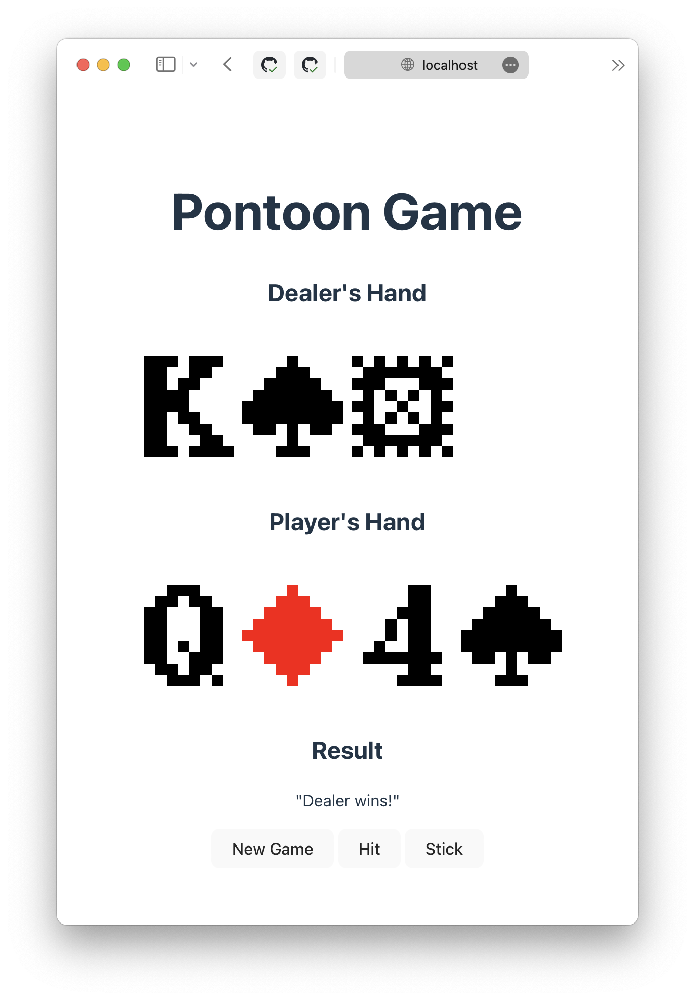

# Slidings Card Game

This project is a learning exercise focused on building an interactive card game using Docker Compose, FastAPI for the backend, and Svelte for the frontend. The initial implementation is a simple MVP version of the Pontoon game, but the goal is to expand it to include multiplayer functionality and other goodies.

<p align="center">
  <br>
  
  <br>
  <br>
</p>


## Features

- **Single Player Pontoon**: The current version allows users to play a basic game of Pontoon (a variation of Blackjack) against the computer.
- **Docker Compose Setup**: The project is containerized using Docker Compose, making it easy to set up and run the application locally.
- **FastAPI Backend**: The backend is built with FastAPI, a modern and high-performance Python web framework for building APIs.
- **Svelte Frontend**: The frontend is developed using Svelte, a component-based framework that offers excellent performance and a reactive programming model. Built using [this template](https://github.com/MJ12358/svelte-template-carbon/tree/main)
- **nginx Proxy**: Not currently used

## Getting Started

To get the project up and running on your local machine, follow these steps:

1. Clone the repository:

```bash
git clone https://github.com/millipz/slidings.git
```

2. Navigate to the project directory:

```bash
cd slidings
```

3. Build and start the containers using Docker Compose:

```bash
docker-compose up --build
```

This command will build the Docker images and start the containers for the backend and frontend services.

4. Access the application in your web browser at `http://localhost:3000`.

## Project Structure

The project follows a standard structure for a Docker Compose setup with separate services for the backend and frontend:

```
.
├── README.md
├── compose.yaml
├── art
│   └── ... <- in progress game art
├── backend
│   ├── Dockerfile
│   ├── Makefile
│   ├── main.py
│   ├── requirements.in
│   ├── src
│   │   └── ... <- Python source
│   └── tests
│       └── ...
├── frontend
│   ├── Dockerfile
│   ├── index.html
│   ├── jsconfig.json
│   ├── package.json
│   ├── public
│   │   └── assets
│   ├── src
│   │   ├── App.svelte
│   │   ├── app.css
│   │   ├── lib
│   │   ├── main.js
│   │   └── vite-env.d.ts
│   ├── svelte.config.js
│   └── vite.config.js
└── nginx.conf
```

- `backend/`: Contains the FastAPI backend code and related files.
- `frontend/`: Contains the Svelte frontend code and related files.
- `docker-compose.yml`: The Docker Compose configuration file that defines the services and their dependencies.

## Contributing

Contributions to this project are welcome! If you find any issues or have suggestions for improvements, please open an issue or submit a pull request.

## Future Enhancements

The following features and enhancements are planned for future development:

- **Multiplayer Support**: Implement multiplayer functionality to allow multiple users to play against each other in real-time.
- **Easter Eggs**: Watch this space.
- **Additional Game Modes**: Introduce new game modes or variations of existing card games.
- **Improved UI/UX**: Enhance the user interface and user experience with better visuals, animations, and responsive design.

## License

This project is licensed under the [MIT License](LICENSE).
